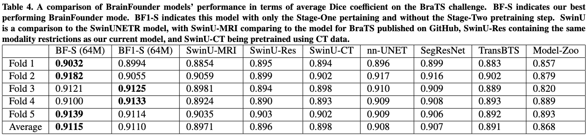
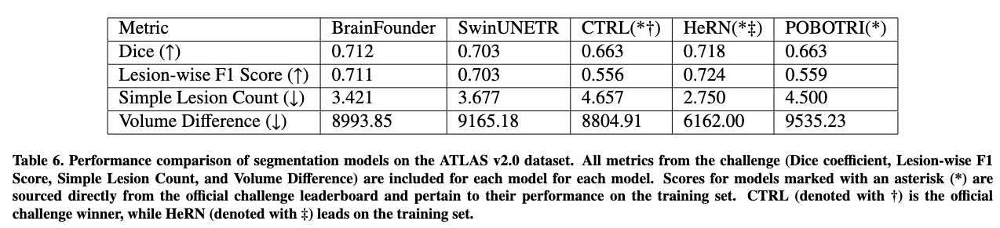

# BrainFounder: Towards Brain Foundation Models for Neuroimage Analysis


We create and provide open-source code of a model and training scheme called BrainFounder. BrainFounder focuses on the
movement towards large-scale models capable of few-shot or zero-shot learning in the neuroimaginge AI space (known as 
Foundation Models). Our results show that BrainFounder provides a promising foundation for the future creation of 
such Foundation Models through its leveraging of massive unlabeled data in self-supervised learning techniques; results
validated through evaluation on the Brain Tumor Segmentation (BraTS) Challenge and the ATLAS v2.0 challenge.

## Paper
This repository provides the official implementation of BrainFounder Stage 1 and 2 Pretraining and Fine-tuning methods
presented in the paper:

**BrainFounder: Towards Brain Foundation Models for Neuroimage Analysis** by Joseph Cox<sup>1</sup>, Peng Liu<sup>1</sup>, 
Skylar E. Stolte<sup>1</sup>, Yunchao Yang<sup>2</sup>, Kang Liu<sup>3</sup>, Kyle B. See<sup>1</sup>, 
Huiwen Ju<sup>4</sup>, and Ruogu Fang<sup>1,5,6,7</sup>

<sup>1</sup> J. Crayton Pruitt Family Department of Biomedical Engineering, Herbert Wertheim College of Engineering, 
University of Florida, Gainesville, USA

<sup>2</sup> University of Florida Research Computing, University of Florida, Gainesville, USA

<sup>3</sup> Department of Physics, University of Florida, Gainesville, FL, 32611, USA

<sup>4</sup> NVIDIA Corporation, Santa Clara, CA, USA

<sup>5</sup> Center for Cognitive Aging and Memory, McKnight Brain Institute, University of Florida, Gainesville, USA

<sup>6</sup> Department of Electrical and Computer Engineering, Herbert Wertheim College of Engineering, University of 
Florida, Gainesville, USA

<sup>7</sup> Department Of Computer Information Science Engineering, Herbert Wertheim College of Engineering, 
University of Florida, Gainesville, USA

## Major Results From the Paper
* Our pretrained model outperformed current state of the art models on BratS across 5 folds. 

* Our model performed competitively with winning models on the ATLAS challenge despite not utilizing ensemble learning


## Directory Overview
This repository is organized into 2 main directories:
### Pretrain
This directory contains scripts and pretrained models for Stage 1 pretraining. Our models are pretrained on the UK 
Biobank dataset using Self-Supervised Learning (SSL) heads and a 3-way loss function. This stage sets the foundation 
for advanced feature extraction crucial for downstream tasks.

### Downstream
This directory includes scripts and pretrained models for Stage 2 pretraining and finetuning. The models are further 
trained and fine-tuned on downstream tasks using datasets such as BraTS and ATLAS, as detailed in our accompanying 
paper. This stage focuses on tailoring our robust pre-trained models to specific tasks to achieve high precision and 
reliability in practical applications.

## Getting Started

Detailed instructions for pretraining/fine-tuning your own models using our scheme can be found in each directory. 
To get started, follow these steps:

1. Clone the repository:
   ```bash
   git clone https://www.github.com/lab-smile/BrainSegFounder.git
   cd BrainSegFounder
   ```
2. Install dependencies. This project was trained using Project MONAI's singularity containers, which we highly recommend 
using. The dependencies for this project are Project MONAI's [dev requirements](https://raw.githubusercontent.com/Project-MONAI/MONAI/dev/requirements-dev.txt) 
and the NPNL Lab's [BIDSIO library](https://github.com/npnl/bidsio/tree/main). You can install both with pip using the following commands:

    ```bash
    pip install -r https://raw.githubusercontent.com/Project-MONAI/MONAI/dev/requirements-dev.txt
    pip install -U git+https://github.com/npnl/bidsio
    ```

3. Navigate to the desired directory to begin working with the code:
    ```bash
   cd pretrain
   # OR 
   cd downstream
    ```
4. Refer to the `README.md` files in each directory for instructions on running the scripts in those directories.

## Issues
If you encounter any problems while using the repository, please submit an issue on GitHub. Include as much detail as 
possible - screenshots, error messages, and steps to reproduce - to help us understand and fix the problem efficiently.


## Contributions
We welcome contributions to this repository. If you have suggestions or improvements, please fork this repository and 
submit a pull request.

## License
This project is licenced under the GNU GPL v3.0 License. See the LICENSE file for details.

## Citation
If you use this code, please cite [our paper](https://arxiv.org/abs/2406.10395)
 
## Acknowledgements
We employ the SwinUNETR as our base model from: https://github.com/Project-MONAI/research-constributeions/tree/main/SwinUNETR
