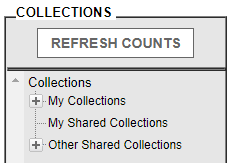
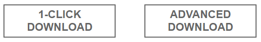
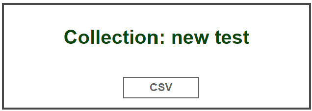

    

# ADNI Data Pipeline
This file will go over gaining access to, searching, downloading, and processing your ADNI data.
> This pipeline uses the following packages on HiPerGator: clinicadl/1.0.4, mricrogl/20211006, ants/2.3.4, matlab/2020b, and fsl/6.0.1

Skip to:
- [Searching for your data](#searching-for-your-data).
- [Downloading your data](#downloading-your-data).
- [Processing your data](#processing-your-data).

Useful Links
- [Clinica Documentation](https://aramislab.paris.inria.fr/clinica/docs/public/latest/)

## Applying for ADNI Access
You need to apply for an account in ADNI before accessing their data. Navigate to the [ADNI](https://adni.loni.usc.edu/) website and go to `DATA & SAMPLES > ACCESS DATA AND SAMPLES` and scroll down for the apply button. Alternatively, find the application [here](https://ida.loni.usc.edu/collaboration/access/appLicense.jsp). You may need to wait a few days for your application to be accepted.

    

## Searching for your data
To access and search for your data, navigate to the [Image & Data Archive (IDA) website](https://ida.loni.usc.edu/login.jsp) and login with your ADNI account.

1. Navigate to SEARCH > ADVANCED IMAGE SEARCH (beta).
2. Fill in the criteria for the images that you need.

### IMPORTANT: You must use the BETA version of the advanced image search. Otherwise, you will be unable to select all image types. 

The general criteria you need are listed below. All other criteria can be left as default, unless needed otherwise. Hold down CTRL and select or deselect multiple options. Tick the `Display in result` boxes for Modality to better view your results.

#### Image Types
- All three types on the left-hand side MUST be ticked. `Original`, `Pre-processed`, `Post-processed`

#### Subject
- `Research Group` defines the different groups.
  - Includes, but are not limited to, Alzheimer's Disease <b>(AD)</b>, Cognitively Normal <b>(CN)</b>, Early Mild Cognitive Impairment <b>(EMCI)</b>, and Late Mild Cognitive Impairment <b>(LMCI)</b>.

#### Image
- `Modality` defines the image modalities.
  - Includes <b>DTI</b>, <b>MRI</b>, <b>PET</b>, and <b>fMRI</b>.
  - Select AND to check for subjects with multiple modalities.

1. Click the SEARCH button in the bottom right.
2. Select the subject, study, or images needed.

### IMPORTANT: A subject's data can be spread across multiple pages. Make sure to check the following pages for the rest of the data under the same subject ID. Failure to do so may result in incomplete data.  

5. Click the ADD TO COLLECTION button in the top right.
6. Save into a new or existing collection.

## Downloading your data
To convert data with clinica, two folders are required: <b>ADNI</b> and <b>clinical_data</b>.
- <b>ADNI</b> includes your imaging data.
- <b>clinical_data</b> includes relevant study data.

According to ADNI FAQs, you can only download on the same computer that the collection was created from.
> Alternatively, data can be downloaded through HiPerGator. Launch a Console GUI through [OpenOnDemand](ood.rc.ufl.edu). Run `module load firefox` then `firefox &` to open an internet browser.[^1]

[^1]: Downloaded files default to the /home/Downloads directory. Note that the quota for /home is 40gb.

### Image Data
1. Navigate to DOWNLOAD > IMAGE COLLECTIONS.
      - You will end up in a similar page if you previously searched for data.
   
2. Open the collection you want to download using the dropdown menu of `My Collections`.

    

3. Check the tick boxes of the images you want to download. The boxes are found to the right side.

4. Once selected, download the data.

    

   - `1-Click Download` downloads into 1 zip folder. 
     - <i>Recommended for <b>small</b> downloads.</i>
  
   - `Advanced Download` downloads into multiple zip folders. 
     - <i>Recommended for <b>large</b> downloads.</i>

5. OPTIONAL: Download a summary of your collection as a .csv. This can be obtained at any point in time.

    

6. Unzip the contents of the zip file(s) into a subfolder within the <b>ADNI[^2]</b> folder. 
- Data can be stored into subfolders for separate processing.
  - Ex. /ADNI/mydata/

[^2]: There is an unzip script on HiPerGator if zip files are too large. This file uses rsync.

### Clinical Data
1. Navigate to DOWNLOAD > STUDY DATA.
2. On the left pane select ALL at the <b>bottom</b> of the list.

    

3. Check the tick box of `[] Select ALL tabular data (csv format)` and click the download button in the top-right to download the clinical data.

    

4. Unzip the contents of the zip file into the <b>clinical_data</b> folder.

## Processing your data

[Skip to Pipeline Steps](#pipeline-steps)

The ADNI data is converted and preprocessed by clinica, and extracted to become ready for deep learning and machine learning purposes. This code organizes data into .nii files of subject brains. The step prior to DLML, CAPS, is the final step for [ClinicaDL](https://clinicadl.readthedocs.io/en/latest/).

### IMPORTANT: There are some limitations to the structure of DLML data. These limitations are listed in known issues, found [here](#known-issues).

### IMPORTANT: clinica can only process PET only if it has an MRI pair from the same study. Otherwise, clinica will skip the PET study.

> The current version on HiPerGator is clinicadl 1.0.4.[^3]

[^3]: clinicadl includes both clinicadl and clinica.

The ADNI data follows the following pipeline:
- ADNI data is converted into BIDS[^4].
- BIDS data is preprocessed into CAPS[^5].
- CAPS data is extracted into DLML[^6].

[^4]: BIDS: Brain Imaging Data Structure
[^5]: CAPS: ClinicA Processed Structure
[^6]: DLML: Deep Learning Machine Learning

### Preprocessing steps performed
Listed below are the preprocessing steps performed on T1 MRI and PET imaging modalities.[^7]

[^7]: More information about preprocessing can be found on [clinica's documentation](https://aramislab.paris.inria.fr/clinica/docs/public/latest/)

#### `t1-linear`
- Bias field correction using [N4ITK](https://ieeexplore.ieee.org/document/5445030).
- Affine registration to the [MNI152NLin2009cSym template](https://bids-specification.readthedocs.io/en/stable/99-appendices/08-coordinate-systems.html#template-based-coordinate-systems) in MNI space with the [SyN algorithm](https://www.sciencedirect.com/science/article/pii/S1361841507000606?via%3Dihub).
- Cropped to remove the background.
- Output crop size is 169-by-208-by-179, 1mm isotropic voxels.

#### `pet-linear`
- Affine registration to the [MNI152NLin2009cSym template](https://bids-specification.readthedocs.io/en/stable/99-appendices/08-coordinate-systems.html#template-based-coordinate-systems) in MNI space with the [SyN algorithm](https://www.sciencedirect.com/science/article/pii/S1361841507000606?via%3Dihub).
- Intensity normalization using the average PET uptake in the cerebellum and pons as reference regions to create a standardized uptake value ratio (SUVR) map.
- Cropped to remove the background.
- Output crop size is 169-by-208-by-179, 1mm isotropic voxels.

#### Definitions
- <b>Affine Registration</b> shears, scales, rotates, and translates images to align or register images to one another based on the degrees of freedom (DOF).
  - Rigid Body (3-6 DOF)
  - Affine (9-12 DOF)
  - Deformation Field (Infinite DOF)
- <b>Symmetric Normalization (SyN)</b> is an affine + deformable transformation, with mutual information as optimization metric.
- <b>N4 Bias Field Correction</b> is a popular method for correcting low frequency intensity non-uniformity in MRI images. MRI images exhibit non-uniformities as a result of magnetic field variations resulting in shading or bias seen as artifacts. Imperfections in the field coils or susceptibility changes at boundaries between anatomical tissue and air. Bias field correction (BFC) estimates a correction field based on a series of local estimates or tissue gain variation. Global tissue values for the mean of white matter, grey matter, and CSF.
- <b>Standardized Uptake Value Ratio (SUVR)</b> is the ratio of the image-derived radioactivity concentration and the whole body concentration of the injected radioactivity.

### Pipeline Steps
The shell scripts for processing ADNI data are made for HiPerGator. These can be run individually for spot checking errors or with the all-in-one file including intermediate outputs.

> Sample data can be found on <b>/blue/ruogu.fang/kylebsee/ADNI_pipeline/ADNI/sample</b>

#### Option 1: Run all-in-one
Simply run <b>`adni2dlml.sh`</b> to process ADNI data into DLML. The arguments are detailed below.

The `ADNI`, `BIDS`, `CAPS`, `DLML`, and `clinical_data` arguments lead to your respective data subfolders. The `ADNI` and `clinical_data` folder is the only folder that initially has data. The `BIDS`, `CAPS`, and `DLML` subfolders are created in the pipeline.

The `clinical_data`, `tracers`, and `mri` folders are fixed folders. `clinical_data` is located in the main directory along with the `ADNI` and `BIDS` folders. `tracers` and `mri` should be located in ./scripts/tools/tracers and /scripts/tools/mri, respectively.

`classlabel` is the label you give the processed data. Note that you need to process one group (i.e. AD, CN, MCI, etc.) at a time to avoid giving the same label. Labels are whole integers.

`testsize` is the size ratio of the testing set. This ratio is between 0 and 1. For example, for a 70%/30% split, testsize=0.3 to indicate 30% of the data belongs in the test set.[^8]

[^8]: Note that this function does not entirely work properly. It is recommended to split your data manually or by writing your own code.

#### Option 2: Run separately
Run each script separately. It functions the same as option 1 and has the same arguments but separated across scripts.

1. Run <b>`adni2bids.sh`</b> to convert ADNI data into BIDS.
2. Run <b>`bids2caps.sh`</b> to preprocess BIDS data into CAPS.
3. Run <b>`caps2dlml.sh`</b> to extract CAPS data into DLML.

## Other Info
### Debugging
If the above scripts do not work, ensure the following.
- When searching for data, ensure that the `Original`, `Pre-processed`, and `Post-processed boxes` are checked. This may result in incomplete data.

### Known Issues
- For some reason, <b>`bids2caps.sh`</b> will not function with relative paths. In the meantime use absolute paths.
- Be careful of running <b>`bids2caps.sh`</b> multiple times. This may result in appending the suffix "_skull_strip" to the .nii.gz more than once. This will break <b>`caps2loader.m`</b> as it expects "_skull_strip.nii.gz".
- Different groups need to be fed separately. For example, do not mix AD and CN subjects. <b>`caps2loader.m`</b> gives a class label to the given data. If you mix data then all input subjects will have the same class label.
- Running <b>`caps2dlrs.m`</b> without enough data samples may result in warnings from cvpartition. The file <b>loader2dl</b> uses a 3rd argument to define a test split ratio between 0 and 1. Ensure you have enough samples to be processed.
- <b>`loader2dlml`</b> did not work properly using the sample data. Further testing is required to apply splits correctly between multiple modalities.

## Last Updated
January 19th, 2023